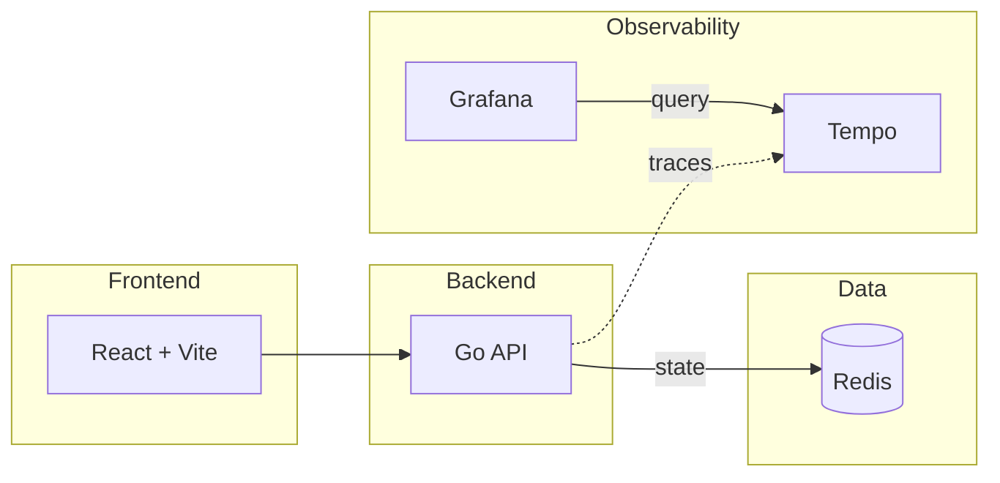

# Tic-Tac-Toe game

Example of a simple (micro)service in Go with frontend in React + Vite.

This service allows clients to play tic-tac-toe game. State is persisted in Redis.

## Architecture

```mermaid
flowchart LR
    subgraph Frontend
        Vite[React + Vite]
    end

    subgraph Backend
        API[Go API]
    end

    subgraph Data
        Redis[(Redis)]
    end

    subgraph Observability
        Tempo[Tempo]
        Grafana[Grafana]
    end

    Vite --> API
    API -->|state| Redis
    API -.->|traces| Tempo
    Grafana -->|query| Tempo
```